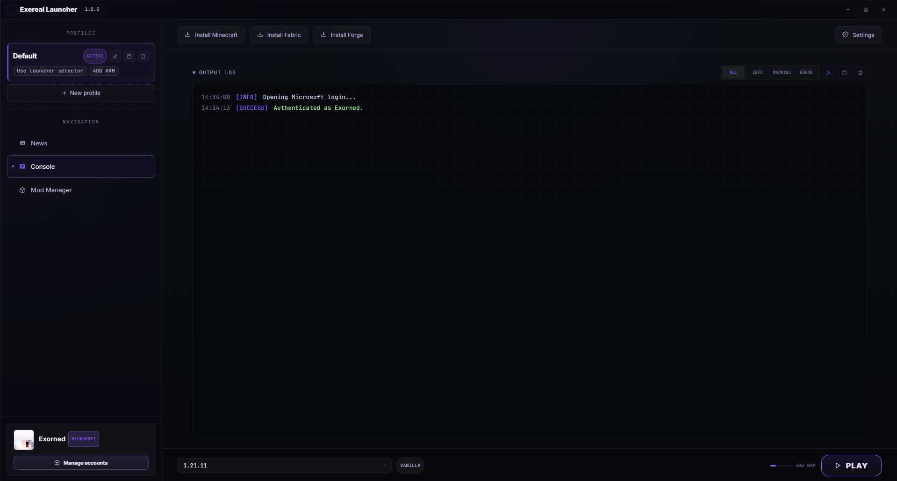

# <p align="center">Exereal Launcher</p>
<p align="center">
  
  
  
</p>

**Exereal Launcher** - быстрый, лёгкий и удобный лаунчер для Minecraft с поддержкой модов, сборок и кастомизации.

## ✨ Возможности

- 🚀 Быстрый запуск игры без лишних задержек
- 🧩 Поддержка модов
- 📦 Установка и обновление сборок в один клик
- 👤 Поддержка нескольких аккаунтов (Microsoft)
- 🎨 Современный и настраиваемый интерфейс
- 🔄 Автоматические обновления лаунчера
- ⚙️ Гибкие настройки Java и памяти

## 📥 Установка

1. Скачайте последнюю версию со страницы [Releases](../../releases).
2. Запустите установочный файл и следуйте инструкциям.
3. Войдите в свой аккаунт Minecraft.
4. Выберите версию или сборку и нажмите **Играть**.

## 🛠️ Сборка из исходников

```bash
# Клонируем репозиторий
git clone https://github.com/Exorned/exereal-launcher.git
cd exereal-launcher

# Устанавливаем зависимости
npm install

# Запуск в режиме разработки
npm run dev

# Сборка проекта
npm run build
```

## 📋 Требования

- Windows 10/11, macOS* или Linux*
- Java 17+ (устанавливается автоматически, если не найдена)
- 4 ГБ ОЗУ или больше

*скоро

## 🖼️ Скриншоты

<p align="center">
  
</p>

## 🤝 Участие в разработке

Приветствуются пул-реквесты и предложения! Чтобы внести вклад:

1. Сделайте форк репозитория
2. Создайте новую ветку (`git checkout -b feature/new-feature`)
3. Внесите изменения и закоммитьте их (`git commit -m 'Add new feature'`)
4. Отправьте изменения (`git push origin feature/new-feature`)
5. Откройте Pull Request

## 🐛 Баг-репорты и предложения

Нашли баг или есть идея? Создайте [issue](../../issues) с подробным описанием.

## 📄 Лицензия

Проект распространяется под лицензией [MIT](LICENSE) © 2026 [Exorned](https://github.com/Exorned) ([русская версия](LICENSE.ru.md)).

## 📬 Контакты

- Telegram: [@Exorned](https://t.me/Exorned)
- Discord: [Сервер проекта](https://discord.gg/)(скоро)

---

<p align="center">© 2026 Exorned</p>
